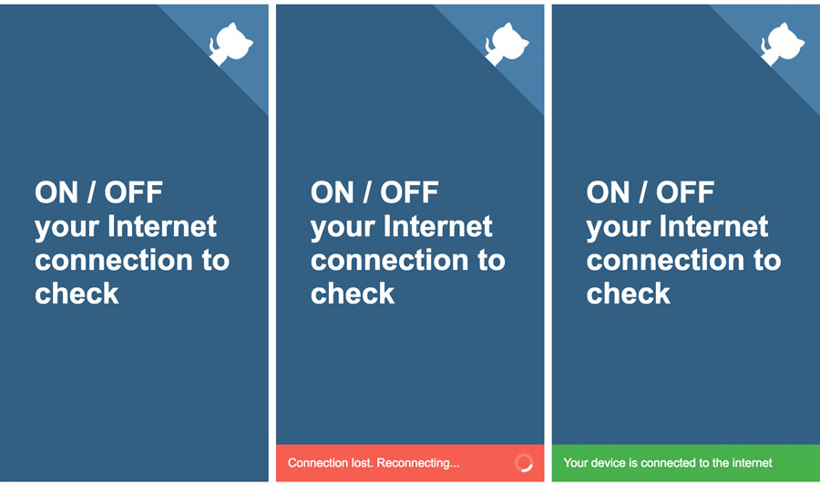

OnlineJS
========

Small library that graphically displays the status of your Internet connection (wifi or 4G).

## Live Demo

Visit [https://onlinejs-library.firebaseapp.com/](https://onlinejs-library.firebaseapp.com/) to see a live demo of OnlineJS.



## Setup

**OnlineJS has no dependencies.** It can be added to any web/mobile/pwa app by including two files:

```HTML
<!-- OnlineJS -->

<link rel="stylesheet" href="online.min.css" />

<script src="online.min.js"></script>
```

That is all !!

## Getting Started with OnlineJS

Turn on or off your connection to your network or wifi to check their working demo.